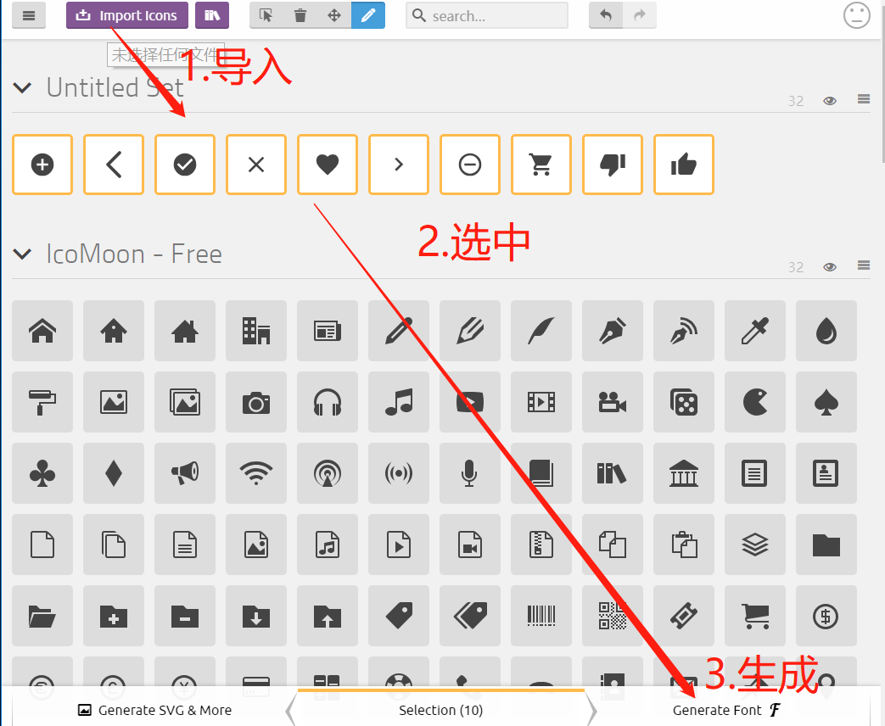
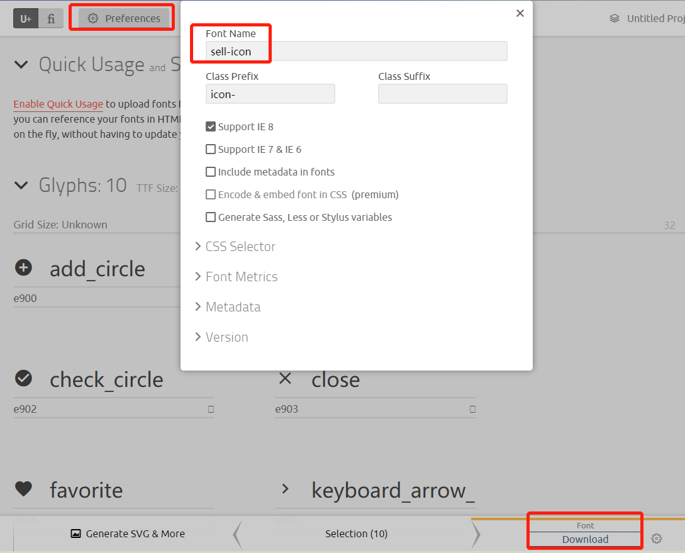
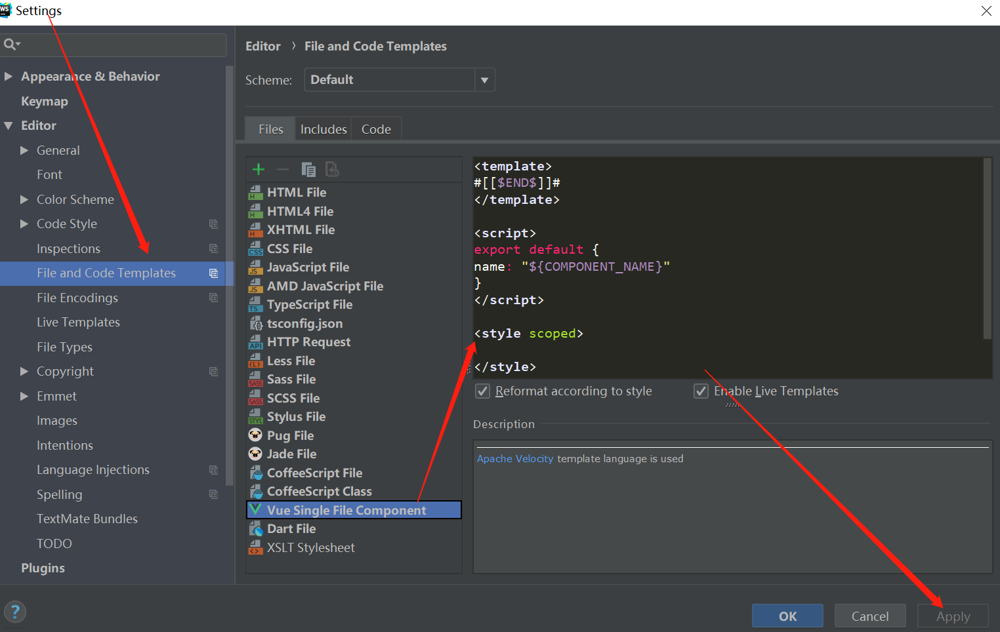

## 慕课网【Vue高仿饿了么】实战课程
- 配合后端代码地址：github.com/cucyoyo/spring-boot-sell 完成全栈的模仿饿了么加购物车、下单、付款的功能
- 由于微信支付功能只有企业版的公众号才可以获得，付款和退款功能暂时不实际实现而是简单模拟


### 环境和构建
- npm install
- 开发环境运行：npm run dev
- 构建：npm run build

### 学习笔记
- 字体icon生成和使用
  - https://icomoon.io/app/
  - 
  - 
  - 下载以后 - 解压 
    - 将fonts目录下的文件都拷贝到项目`src/common/fonts`目录下
    - 将style.css拷贝到项目`src/common/stylus/目录下，改名为icon.styl并将文件中的大括号和分号都去掉，将css语法改成stylus语法
    
- 模拟假数据
  - 数据都在data.json文件中（主要有三个大的类：seller/goods/ratings）(应该是老师网络抓包得到的一些数据)
  - 项目根目录下prod.server.js文件中是模拟接口的一个设置，主要使用node的express-apiRouter给三个路由，测试接口的方法,
  访问：`http://127.0.0.1:8081/api/seller` `http://127.0.0.1:8081/api/goods` `http://127.0.0.1:8081/api/ratings`
  即可获取到接口json数据
  - google chorme插件jsonView可以自动格式化网页的json数据

- static/css/reset.css将默认样式reset掉，将各浏览器默认样式reset掉
  - http://cssreset.com给的标准的reset样式，在`index.html`中引入
  
- `index.html`中设置默认移动端初始宽高设置
```
<meta name="viewport"
           content="width=device-width,initial-scale=1.0,maximum-scale=1.0,minimum-scale=1.0,user-scalable=no">
```
- eslint规范设置
  - eslintrc.js中设置强制在语句后加冒号，否则报错()
    `'semi': ['error', 'always'],`
  - 不检查缩进是空格还是tab`'indent': 0,`
  - 代码中跳过eslint某些检查
```js
// 跳过eslint对new对象必须赋给一个值的校验
/* eslint-disable no-new */
new Vue({...})
```

- 给.vue-component设置默认模板，使得每次新建时自动生成默认的代码，不用每次都重复写



- 解决header作为组件名称与h5标签冲突的问题,给header一个别名，本项目统一用v-xxx作为组件的名称
```
components: {
      'v-header': header
    }
```
- vue-loader里面的postcss会自动帮我们解决浏览器兼容性的问题，否则flex等等内容应该有兼容各个浏览器的多行代码

- 三等分布局 - flex
```html
<div class="tab">
  <div class="tab-item">商品</div>
  <div class="tab-item">评论</div>
  <div class="tab-item">商家</div>
</div>
```
```stylus
.tab
  display flex
  width 100%
  height 40px
  line-height 40px
  .tab-item
    flex 1
    text-align center

```

- vue-router
  - npm i xx --save
  - import router from './router/index.js';
  (import router from 'vue-router'; Vue.use(router))
  
```html
<div class="tab border-1px">
  <div class="tab-item">
    <router-link to="/goods">商品</router-link>
  </div>
  <div class="tab-item">
    <router-link to="/ratings">评论</router-link>
  </div>
  <div class="tab-item">
    <router-link to="/seller">商家</router-link>
  </div>
</div>
<keep-alive>
  <router-view :seller="seller"></router-view>
</keep-alive>
```
或：`<a v-link="{path:'/seller'}">商家</a>`
```
{
  path: '/',
  redirect: '/goods'
}
```

- webpack别名配置（build/webpack.base.conf.js）
```
alias: {
      'src': path.resolve(__dirname, '../src'),
      'common': path.resolve(__dirname, '../src/common'),
      'components': path.resolve(__dirname, '../src/components')
    }
```
- 把a标签的`{text-decoration: none}`放到reset文件中去

- css样式设置顺序规范
  - 布局
  - 宽高
  - 字体等等

- vue-router统一设置active时的类
  - 1.在router/index.js中设置，这时vue-router active时会被自动设置active的class
```
export default new Router({
    linkActiveClass: 'active',
    routes
});
```
  - 2.在vue-link标签上设置样式即可
```stylus
& > a
  display: block
  font-size: 14px
  color: rgb(77, 85, 93)
  &.active
    color: rgb(240, 20, 20)

```

- 在手机上看到开发环境的页面：`电脑IP:port/`在草料二维码网站生成二维码手机扫描就可以看到
（前提是在config/index.js中要将host设置成0.0.0.0而非127.0.0.1、localhost）

- 开发时候的像素和手机显示的宽度高度与有所差距，
手机屏幕的物理尺寸，和像素尺寸是不成比例的，真正决定显示效果的是逻辑像素；
前端的ui设计图的像素是真实像素，现在很多手机dpi倍率为2，电脑上开发需要将像素除以2，放到手机上看的时候它会自己放大两倍；

- 用common/stylus/mixin.styl中定义了一些通用的css样式函数
  - 定义 注意absolute要定义一下width否则没有宽度
```stylus
border-1px($color)
  position: relative
  &:after
    display: block
    position: absolute
    left: 0
    bottom: 0
    width: 100%
    border-top: 1px solid $color
    content: ' '
```
  - 使用`border-1px(rgba(7, 17, 27, 0.1))`
  - 给使用的地方设置一个class：border-1px
  - 设置一个全局的缩放（对border-1px的after伪类进行设置）
```stylus
// dpi 1.5以上的 做一个缩放
@media (-webkit-min-device-pixel-ratio: 1.5),(min-device-pixel-ratio: 1.5)
  .border-1px
    &::after
      -webkit-transform: scaleY(0.7)
      transform: scaleY(0.7)
// dpi 2以上的 做一个缩放
@media (-webkit-min-device-pixel-ratio: 2),(min-device-pixel-ratio: 2)
  .border-1px
    &::after
      -webkit-transform: scaleY(0.5)
      transform: scaleY(0.5)
```
- @import是stylus的一个语法，可以引用其他的stylus
- 项目原本用的是vue-resource进行前后端交互，这里我们可以替换为axios

- 设置image-background
```stylus
.brand
  display: inline-block
  vertical-align: top
  width: 30px
  height: 18px
  background-image: url("xxxseller.png")
  background-size: 30px 18px
  background-repeat: no-repeat
```
- 垂直方向上向上对齐：vertical-align: top

### 其他问题：需要更加深入理解
- export / export default
